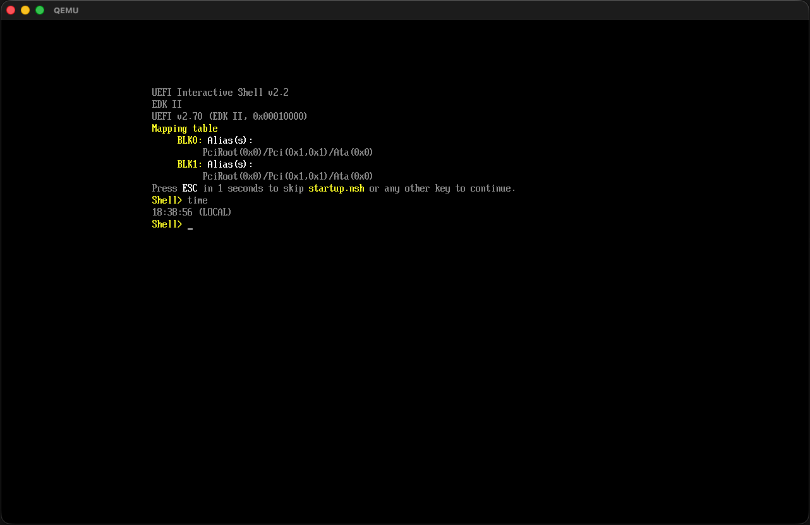

# open_kernel

A bare-metal Rust kernel for `x86_64` - no standard library, no operating system underneath. Built from scratch using Rust nightly with a custom target, hand-wired drivers, and a fully custom UEFI bootloader.

This project is currently a kernel, not a full desktop/server operating system. It boots, initializes core hardware and memory services, and runs a small cooperative task scheduler inside the kernel itself.

```text
    ___   _  __   root@open_kernel
   / _ \ | |/ /   ----------------
  | | | || ' /    OS: open_kernel 0.1.0 x86_64
  | |_| || . \    Kernel: 0.1.0-baremetal
   \___/ |_|\_\   Uptime: 165 ticks
                  Heap: 384 / 262144 B (261760 free)
                  Shell: custom (vfs enabled)
```



## What it does today

- Boots into a `#![no_std]`, `#![no_main]` kernel via a custom UEFI bootloader.
- Initializes core x86_64 architecture features: GDT, TSS, IDT, and PIC.
- Sets up virtual memory paging and a 256 KiB kernel heap with live heap usage diagnostics (`meminfo`).
- Uses a cooperative round-robin scheduler with dynamic task creation (`spawn`) and termination (`kill`).
- Handles hardware interrupts for timer and keyboard (PS/2 scancode set 1).
- Features an in-memory RamFS Virtual File System (VFS) with support for files and directories (`ls`, `cat`, `touch`, `write`, `mkdir`, `rm`).
- Hardware CPUID detection for CPU vendor strings and system capabilities (`cpuid`).
- Hardware soft reset (`reboot`) and QEMU ACPI poweroff (`shutdown`).
- Interactive shell featuring custom prompt (`prompt`), VGA themes (`color`), ASCII matrix rain (`matrix`), basic calculator (`calc`), and guessing game (`guess`).
- Outputs to both the UEFI GOP framebuffer and a UART serial port simultaneously.

## Building and running

### Prerequisites

```bash
rustup toolchain install nightly
rustup component add rust-src --toolchain nightly
rustup target add x86_64-unknown-uefi
```

You also need QEMU with OVMF firmware installed:

- **macOS:** `brew install qemu`
- **Linux:** `sudo apt install qemu-system-x86 ovmf`

### Build and Run

The simplest way to build the kernel, bootloader, and run the OS in QEMU is to use the provided `run.sh` script:

```bash
./run.sh
```

This script will automatically:
- Build the kernel and custom UEFI bootloader
- Create a virtual FAT directory under `build/mnt`
- Copy the compiled files into the virtual EFI system partition
- Start the OS in QEMU with an interactive COM1 terminal
- Mirror COM1 output into `serial.log`

After the prompt appears, type commands either in the terminal that
launched `run.sh` or by clicking the QEMU window and using its PS/2 keyboard.

## Wishlist

Roadmap of things that would turn this kernel into a more complete operating system:

- Preemptive multitasking and real context switching with per-task CPU state.
- Separate stacks for each task.
- User mode support and privilege switching.
- System calls so user programs can request kernel services.
- Process creation, termination, and waiting.
- [x] Per-process virtual memory spaces and memory isolation (`vmap`).
- ELF loading for executable binaries.
- [x] A file system layer (In-memory RamFS VFS implemented).
- [x] Better keyboard input handling, including modifiers and special keys (`modifiers`, arrow history).
- [x] Basic driver model for storage and graphics (`driver.rs`, `drivers` command).
- [x] Network stack support (`net.rs`, `ifconfig`, `ping`, `netstat` commands).
- Multicore bring-up and scheduler scaling.
